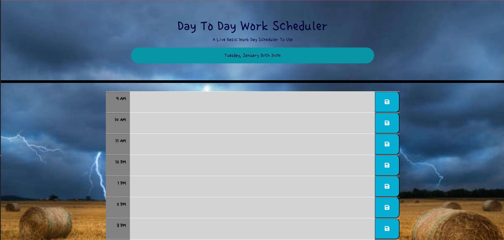

# Daily Work Schedule website

## In this website you'll be provided a typical 9am to 5pm schedule that you can use to make yourself notes for the times that you want to place your activities in, mental notes, or daily tasks to remind yourself what you need to get done during those hours or however you feel the need to use it.

# Task

## to create a fast and easy simple calender website that allows a user to input tasks effectively that can be saved to the local storage

# User Guide

As an employee with a busy schedule
 
I want to add important events to a daily planner
 
So that I can manage my time effectively

# Acceptance Criteria

GIVEN I am using a daily planner to create a schedule
 
WHEN I open the planner
 
THEN the current day is displayed at the top of the calendar
 
WHEN I scroll down
 
THEN I am presented with timeblocks for standard business hours of 9am&ndash;5pm
 
WHEN I view the timeblocks for that day
 
THEN each timeblock is color coded to indicate whether it is in the past, present, or future
 
WHEN I click into a timeblock
 
THEN I can enter an event
 
WHEN I click the save button for that timeblock
 
THEN the text for that event is saved in local storage
 
WHEN I refresh the page
 
THEN the saved events persist

# Deployment

[GitHub](https://github.com/Clowenthal/daily-scheduler)
Link to my GitHub Repo

[WebApp](https://clowenthal.github.io/daily-scheduler/)
Link to my deployed page

